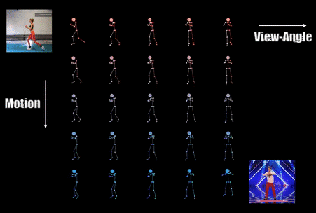

# Learning Character-Agnostic Motion for Motion Retargeting in 2D

We provide PyTorch implementation for our paper [_Learning Character-Agnostic Motion for Motion Retargeting in 2D_](http://xyz), SIGGRAPH 2019.

<p align="center">
  
</p>

## Prerequisites

- Linux
- CPU or NVIDIA GPU + CUDA CuDNN
- Python 3
- PyTorch 0.4


## Getting Started

### Installation

- Clone this repo

  ```bash
  git clone https://github.com/ChrisWu1997/2D-Motion-Retargeting.git
  cd 2D-Motion-Retargeting
  ```

- Install dependencies

  ```bash
  pip install -r requirements.txt
  ```


### Run demo examples

We provide pretrained models and several video examples, along with their OpenPose outputs. After run, the results (final joint positions + videos) will be saved in the output folder.

- Run the full model to combine motion, skeleton, view angle from three input videos:

  ```bash
  python predict.py -n full --model_path ./model/pretrained_full.pth -v1 ./examples/tall_man -v2 ./examples/midget -v3 ./examples/workout_march -h1 720 -w1 720 -h2 720 -w2 720 -h3 720 -w3 720 -o ./outputs/full-demo --max_length 120
  ```

  Results will be saved in `./outputs/full-demo`.

- Run the full model to do interpolation between two input videos. For example, to keep body attribute unchanged, and interpolate in motion and view axis:

  ```bash
  python interpolate.py --model_path ./model/pretrained_full.pth -v1 ./examples/model -v2 ./examples/tall_man -h1 720 -w1 720 -h2 720 -w2 720 -o ./outputs/interpolate-demo.mp4 --keep_attr body --form matrix --nr_sample 5 --max_length 120
  ```

  You will get a matrix of videos that demonstrates the interpolation results.

- Run two encoder model to transfer motion and skeleton between two input videos:

  ```bash
  python predict.py -n skeleton --model_path ./model/pretrained_skeleton.pth -v1 ./examples/tall_man -v2 ./examples/midget -h1 720 -w1 720 -h2 720 -w2 720 -o ./outputs/skeleton-demo --max_length 120
  ```

- Run two encoder model to transfer motion and view angle between two input videos:

  ```bash
  python predict.py -n view --model_path ./model/pretrained_view.pth -v1 ./examples/tall_man -v2 ./examples/model -h1 720 -w1 720 -h2 720 -w2 720 -o ./outputs/view-demo --max_length 120
  ```


### Use your own videos

To run our models with your own videos, you first need to use [OpenPose](https://github.com/CMU-Perceptual-Computing-Lab/openpose) to extract the 2D joint positions from the video, then use the resulting JSON files as described in the demo examples.


## Train from scratch

### Prepare Data

- Download Mixamo Data

  For the sake of convenience, we pack the Mixamo Data that we use. To download it, see [Google Drive](https://drive.google.com/open?id=1UGS-wFRzyLCReJcCN6rdVtRzKBjFa7t1) or [Baidu Drive](https://pan.baidu.com/s/1fYN4QYWOOQH9ZKOY5_2Upw) (8jq3). After downloading, extract it into `./mixamo_data`.

  > NOTE: Our Mixamo dataset only covers a part of the whole collections provided by the Mixamo website. If you want to collect Mixamo Data by yourself, you can follow the our guide [here](https://github.com/ChrisWu1997/2D-Motion-Retargeting/blob/master/dataset/Guide%20For%20Downloading%20Mixamo%20Data.md).

- Preprocess the downloaded data

  ```
  python ./dataset/preprocess.py
  ```

### Train

- Train the full model (with three encoders) on GPU:

  ```
  python train.py -n full -g 0
  ```

  Further more, you can select which structure to train and which loss to use through command line arguments:

  `-n` : Which structure to train. 'skeleton' / 'view' for 2 encoders system to transfer skeleton/view. 'full' for full system with 3 encoders.

  `—disable_triplet`: To disable triplet loss. By default, triplet loss is used.

  `—use_footvel_loss`: To use foot velocity loss.


## Citation
If you use this code for your research, please cite our paper:
```
@article{aberman2019learningl,
  author = {Aberman, Kfir and Wu, Rundi and Lischinski, Dani and Chen, Baoquan and Cohen-Or, Daniel},
  title = {Learning Character-Agnostic Motion for Motion Retargeting in 2D},
  journal = {ACM Transactions on Graphics (TOG)},
  volume = {xx},
  number = {xx},
  pages = {xx},
  year = {2019},
  publisher = {ACM}
}

```
